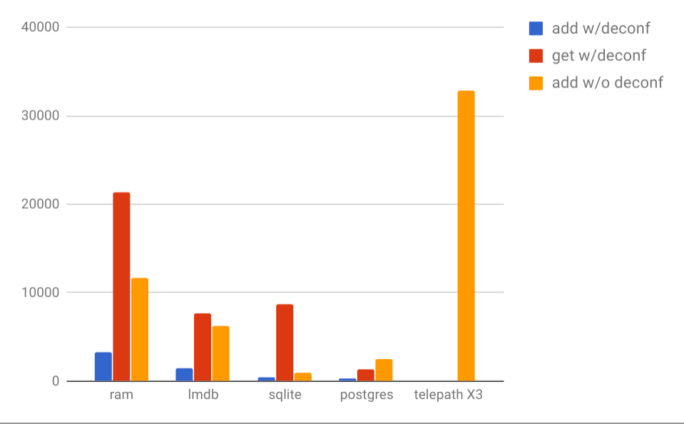

.. note::
   This document was generated from a single raw nbconvert cell containing only RST

Synapse Performance - 3
=======================

Measuring the performance of a synapse cortex is a complex undertaking which depends
not only on the test configurations, but the "shape" of the data being ingested and
queried.  These tests attempt to take an accurate measure of a set of "bookend" data sets
selected specifically to demonstrate best case and worst case ingest performance.

A Note on Comparisons
---------------------

"It doesn't matter that a 747 can carry more passengers than the Space Shuttle, when the mission
is to repair a satellite" -visi

When comparing these numbers to benchmarks published by various big data systems such
as Hadoop and Elastic Search, it is critical to keep in mind the fundamental difference
between a knowledge system like a synapse cortex versus a simple indexer such as Elastic Search.
A knowledge system is required to deconflict all new data against what is already known.  This
means for each new node added to the hypergraph, it must atomically determine if that node already
exists so there is only ever one node which represents a particular thing.  While many big data
systems claim this type of ACID compliant deconfliction is possible, our testing has shown that
the claimed performance of these types of systems is drastically reduced when required to carry
out atomic check-and-add operations.

However, there is also an advantage for a deconflicted knowledge system.  When encountering a node
which has been previously observed, the system does not create a new node.  This has the counterintuitive
effect of making a cortex typically become faster as it ingests more data.  This performance
increase is especially true when ingesting data with many recurrent nodes.

Test Data Sets
--------------

Majestic Million
````````````````

The Majestic Million is a ranked list of a million FQDNs which is freely
available at http://downloads.majestic.com/majestic_million.csv .

This dataset was selected for performance benchmarking due to it being a "worst case" bookend.
Within a cortex, inet:fqdn nodes undergo extensive normalization and often the creation of one
inet:fqdn node causes the creation of several others.  For example, creating inet:fqdn=www.woot.com
would subsequently cause the creation of inet:fqdn=woot.com and inet:fqdn=com.  Additionally, the
FQDNs within the Majestic Million dataset are already deconflicted, meaning each FQDN only occurs
once within the dataset.  This causes every record to deconflict and create new nodes.

Non-Deconflicted
````````````````

A synapse cortex is also capable of ingestion and indexing of "instance knowledge" which is not
typically deconflicted.  The primary property for such nodes is typically a system generated GUID
and insert times are typically higher.  This test is intended to be close to a "best case" scenario
where node insertion is not being atomically deconflicted and node properties are not subject
to extensive normalization rules.

Cortex Configurations
---------------------

Each of the supported storage technologies used by a synapse cortex are tested.  Where possible,
tests are executed with minimal or no specialized configuration in an attempt to show performance
capabilities without the use of exotic configuration.  All cortex instances are configured without
caching in an attempt to measure the speed of the storage layer implementations rather than the
caching subsystem.  A production cortex configured with caches is likely to perform queries much
faster than these results.

ram-1
`````

The RAM storage backing provides cortex storage and indexing using native python data structures
such as dictionaries and lists.  This configuration is a highly performant cortex typically used
for hypergraph data which can fit in system memory.  For these tests, the RAM cortex is initialized
with default configuration options.

lmdb-1
``````

The LMDB storage backing provides cortex storage and indexing using the Symas Lightning DB
available here: https://symas.com/lightning-memory-mapped-database/
For these tests, the lmdb cortex is initialized with default configuration options.

sqlite-1
````````

The sqlite storage layer provides cortex storage and indexing using the SQLite embedded database
library which is built into the python interpreter.  For these tests, the sqlite-1 cortex
is intitialized with default values.

postgres-1
``````````

The Postgres storage layer provides cortex storage and indexing using the Postgresql Database
available here: https://www.postgresql.org/.  For these tests, the Postgresql cortex is initialized
with default values communicating with a default Postgresql 9.5 database on Ubuntu 16.04 LTS.

telepath-x3
```````````

The Telepath cluster test is designed to measure the scalability of a multi-cortex federation which
is operating with the assumption of shard-based division of node creation across several cortex
hypergraphs.  The primary purpose of the test is to determine the expected overhead of cluster
logic and network protocol efficiency.  The remote cortexes are simple RAM cortexes.

Test Systems
------------

The current benchmark testing environment is a cluster of 3 hosts with the following hardware:

* Intel(R) Xeon(R) CPU E5-2609 v4 @ 1.70GHz (8 cores)
* 256 GB Memory
* 1000 base T network interface ( 1 Gbps )
* 8x 7200 RPM Seagate ST8000NM0055-1RM112 disks

Results
-------

Each of the test results below shows how the various test configurations perform under the different
benchmark tests.  In sections below, we discuss results for individual configurations and what that
means when selecting how to select a cortex configuration for a given purpose.



+----------------------------+-------------+------------+-------------+------------------+----------------+
| benchmark                  | ram-1       | lmdb-1     | sqlite-1    | postgresql-1     | telepath-x3    |
+============================+=============+============+=============+==================+================+
| add w/deconf (nodes/sec)   |        3,347|       1,478|          385|               336|                |
+----------------------------+-------------+------------+-------------+------------------+----------------+
| query node (queries/sec )  |       21,296|       7,610|         8681|             1,304|                |
+----------------------------+-------------+------------+-------------+------------------+----------------+
| add w/o deconf (nodes/sec) |       11,460|       6,310|          911|             2,473|          32,779|
+----------------------------+-------------+------------+-------------+------------------+----------------+

ram-1
`````

As expected, the ram-1 cortex has the advantage of speed.  In instances where it is possible to dedicate
enough memory to a Cortex, this configuration can be deployed to achieve maximum deconfliction performance
as well as being the fastest to query.  However, for large data sets this definitely puts a limit on use
of 32 bit platforms and lower memory server configurations.  Another potential limitation in the use of a ram
cortex is startup time.  In the case of a ram cortex which has enabled persistence, there may be a very
long startup time during a reboot due to the cortex needing to playback change events on disk to reach the
current state.

Further testing will profile how much ram is expected for use by a cortex with a given population of nodes.

lmdb-1
``````

The lmdb-1 configuration strikes a powerful balance between performance and persistence.  It is highly likely
that this configuration will become the recommended default configuration for production deployments.

sqlite-1
````````

The sqlite-1 configuration demonstrates the powerful query speed of the underlying sqlite db backend.
However, transactional limits and insert speeds are quite a bit slower.  This makes an sqlite Cortex
most ideal for use with large datasets which grow a bit more slowly but are expected to be queried very
quickly.

postgres-1
``````````

The postgres-1 configuration is the only test configuration which uses a storage mechanism which resides
outside the python process running the Cortex.  This requires the use of Inter Process Communication (IPC)
using local pipes, and forces many context switches in comparison with the other configurations.

However, future testing of parallel query execution is expected to demonstrate postgres as a highly capable
parallel query platform, potentially making it more attractive for use with a larger number of querying clients.

telepath x3
```````````

Current results show highly efficient scale gains when using multiple cortexes in a federated configuration.
However, the current testing environment involves the use of only 3 systems.  Future scale testing
using additional hardware will be a better estimate of performance in a truly production scale cluster.
That being said, current results are promising.

* scale efficiency: 2.8 / 3.0

Future testing of parallel query execution is expected to achieve even higher levels of efficiency.

Additional Tests
----------------

Over the course of subsequent releases, a table will be added here showing the performance of releases
over time using line graphs showing the various test results over time.  Additionally, tests which measure
parallel query performance will be implemented to demonstrate storage backings which operate well or poorly
under highly parallel query load.


